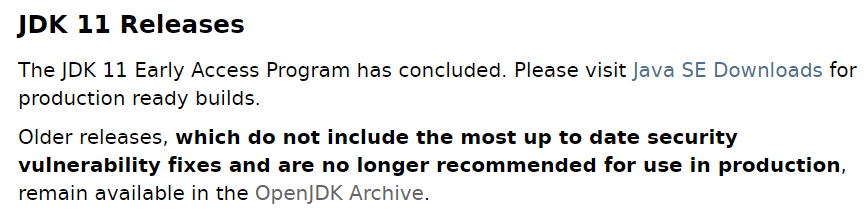

# 01. Development Environment

## 00. Environment

### 00.01 OS : Windows 11 x64

### 00.02 Development kit

- JDK 11
- IDE
    - STS3 : Eclipse + Spring & Spring boot PlugIn
        - STS4 : Only Spring boot
    - IntelliJ

---

## 01. JDK Install

### 01.01 JDK 11 Download

- URL : [https:/jdk.java.net/11/](https:/jdk.java.net/11/)
    - OpenJDK Archive
    
    
    
    - 11 version 중 암것나 선택
        - 11.0.2 Zip file 다운로드.
        - GA : General Availability : 배포 가능 버전
    
    
    
    
    
    ---
    

## 02. STS Install

### 02.01 STS3 Download

- URL : [https:/github.com/spring-attic/toolsuite-distribution/wiki/Spring-Tool-Suite-3](https:/github.com/spring-attic/toolsuite-distribution/wiki/Spring-Tool-Suite-3)
    - Spring Tool Suite3 wiki
    
    
    
    - 첫 번째 URL
    
    
    

---

## 03. IntelliJ Insall

### 03.01 IntelliJ Ultimate Download

> 무료판은 Sping boot만 된다.
유료판 30일 무료판 다운로드 후 사용
> 
- URL : [https:/www.jetbrains.com/ko-kr/idea/download/?section=windows](https:/www.jetbrains.com/ko-kr/idea/download/?section=windows)
    - ultimate version download
    
    